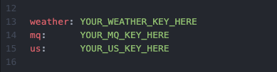

[![LinkedIn][linkedin-shield]][linkedin-url]

<!-- PROJECT LOGO -->
<br />
<p align="center">
  <a href="https://github.com/austinandrade/sweater-weather-be">
    
  </a>
  
 <details open="open">
  <summary>Table of Contents</summary>
  <ol>
    <li>
      <a href="#about-the-project">About The Project</a>
      <ul>
        <li><a href="#built-with">Built With</a></li>
      </ul>
    </li>
    <li>
      <a href="#getting-started">Getting Started</a>
      <ul>
        <li><a href="#prerequisites">Prerequisites</a></li>
        <li><a href="#installation">Installation</a></li>
      </ul>
    </li>
    <li><a href="#license">License</a></li>
    <li><a href="#contact">Contact</a></li>
    <li><a href="#learning-goals-&-accomplishments">Learning Goals & Accomplishments</a></li>
  </ol>
</details>
  
  
<!-- ABOUT THE PROJECT -->
## About The Project

*TO DO:* PLACE DESCRIPTION HERE

### Built With

* [RubyOnRails](https://rubyonrails.org/)
* [PostgreSQL](https://www.postgresql.org/)
* [Travis](https://www.travis-ci.com/)
* [Figaro](https://github.com/laserlemon/figaro)
* [Fast Json API](https://github.com/Netflix/fast_jsonapi)

* [RSpec](https://rspec.info/)
* [Simplecov](https://github.com/simplecov-ruby/simplecov)
* [Rubocop](https://github.com/rubocop/rubocop)
* [Webmock](https://github.com/bblimke/webmock)
* [VCR](https://github.com/vcr/vcr)


### Prerequisites 
  
  This application is dependent on having [Ruby](https://www.ruby-lang.org/en/), [RubyOnRails](https://rubyonrails.org/), and [PostgreSQL](https://www.postgresql.org/) installed.
  See [this](https://www.youtube.com/watch?v=Qn-1egqgsnM) video for a detailed guide on setup of your local environment and all dependencies.
  
### Installation

1. Fork the repo
2. Clone the repo
   ```sh
   git clone git@github.com:your-username/sweater-weather-be.git
   ```
3. Install dependencies
   ```sh
   bundle install
   ```
4. Create PostgreSQL database
   ```sh
   rake db:{drop,create,migrate,seed}
   ```
5. Register for [MapQuest](https://developer.mapquest.com/documentation/geocoding-api/), [OpenWeather](https://openweathermap.org/api/one-call-api) and [UnSplash](https://unsplash.com/developers) API keys
  
6. Create an application.yml file
   ```sh
   touch config/application.yml
   ```
7. Paste your MapQuest, OpenWeather, and UnSplash API keys as pictured
    <p align="left">
  <a href="https://github.com/austinandrade/sweater-weather-be">
    
  </a>
  
8. Initialize rails server
   ```sh
   rails s
   ```
  
*Utilize [Postman](https://www.postman.com/) or localhost:3000 to call endpoints:*
#### All available endpoints: 
  1. GET /api/v1/forecast?location={put_location_here}  
      returns the current, daily and hourly forecast of a given location.
      
  2. GET /api/v1/backgrounds?location={put_location_here} 
      returns a background image based on the input location.
      
  3. POST /api/v1/users  // include: {username, password and password_confirmation} as raw body data 
      creates a user record in the database and returns the email and api_key of said user.
      
  4. POST /api/v1/sessions // include: {username and password } as raw body data
      attemps to login the user with passed data and returns email and api_key of existing user if successful.
      
  5. TO DO: CREATE LAST ENDPOINT AND PASTE HERE
  
  
<!-- Learning Goals & Accomplishments -->
## Learning Goals & Accomplishments

- *TO DO:* ACCOMPLISHMENTS HERE

<!-- CONTACT -->
## Contact

Email - [austinmandrade@gmail.com](austinmandrade@gmail.com)

<!-- MARKDOWN LINKS & IMAGES -->
<!-- https://www.markdownguide.org/basic-syntax/#reference-style-links -->
[linkedin-shield]: https://img.shields.io/badge/-LinkedIn-black.svg?style=for-the-badge&logo=linkedin&colorB=555
[linkedin-url]: https://www.linkedin.com/in/austinandrade/
